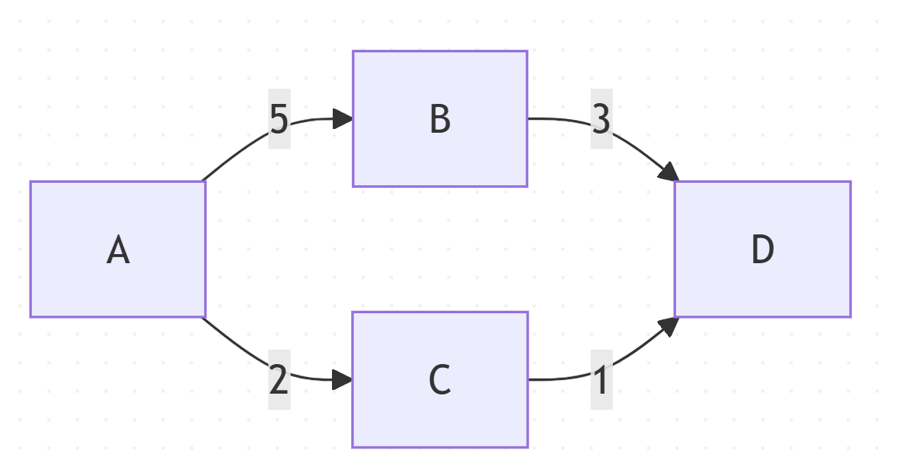
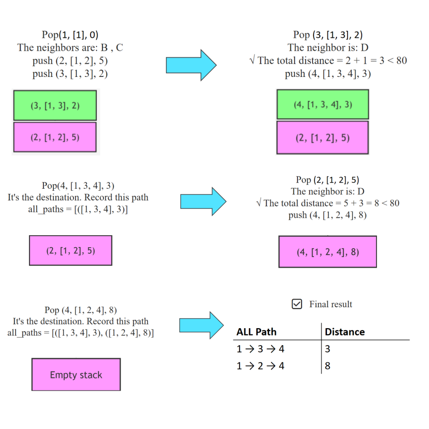
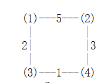
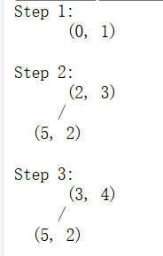

## 1. Description of Project
### 1.1 Project Introduction

This project develops an urban bus network analysis system: modeling stops (nodes) and routes (directed edges) via graph theory to enable dynamic network construction, multi-route travel time prediction (weighted by zone types), Dijkstra's shortest path algorithm, and route efficiency optimization (Efficiency=Distance/Time). Key innovation validates "shortest path ≠ most efficient path", with extensions for peak-hour traffic simulation and stop utilization analytics, delivering a decision-making tool for smart transit.

### 1.2 Design Requirements & Analysis  
This project aims to develop an urban bus network analysis system to meet the following core requirements:
1. **Dynamic Network Modeling & Management**  
   - Support dynamic construction of the bus network using graph theory, with stops as nodes and routes as edges. The system allows flexible addition, deletion, and modification of stops and routes to adapt to real-world network changes.
2. **Multi-path & Efficiency Analysis**  
   - Implements multiple path-finding algorithms (e.g., Dijkstra's shortest path, DFS all paths), enabling not only shortest path calculation but also efficiency analysis (Efficiency = Distance/Time), validating that "shortest path ≠ most efficient path" in practice.
3. **Zoning & Peak-hour Simulation**   
   - Stops are categorized (residential, commercial, industrial, mixed), each with different waiting times. The system supports peak-hour traffic simulation to analyze the impact of congestion on path selection and efficiency.
4. **Visualization & Interactive Experience**   
   - Provides an intuitive, interactive graphical interface for real-time display of the network structure, paths, and stop types, facilitating user operation and decision-making.
5. **Data Analysis & Optimization Suggestions**   
   - Supports stop utilization analysis, dwell time statistics, and route optimization suggestions to assist in system optimization and management decisions.
6. **Scalability & Real-time Capability**  
   - The architecture supports large-scale networks (millions of stops and routes) and can integrate real-time bus data for future expansion and practical application needs.

#### Features

- **Interactive Network Visualization**: Real-time graphical representation of transport networks with stations and connections
- **Multiple Path Finding Algorithms**: 
  - Dijkstra's algorithm for shortest path calculation
  - DFS for alternative path exploration
- **Network Management**: Add, remove, and modify stations and connections
- **Zone-based Analysis**: Different station types (Residential, Commercial, Industrial, Mixed) with varying wait times
- **Efficiency Analysis**: Compare different path options based on distance and efficiency metrics
- **User-friendly GUI**: Intuitive interface with color-coded visualizations and interactive controls
- **Dynamic Path Visualization**: Show travel time and distance on selected path
- **Path Comparison**: Highlight and compare multiple paths for optimal selection
- **Peak-Hour Simulation**: Extend path analysis to simulate traffic congestion
- **Stop Utilization Insights**: Analyze and visualize stop dwell times and frequencies
- **Route Optimization**: Suggest modifications to existing routes based on travel demand

## 2.Quick Start
### 2.1 Project Structure

```
efrei2025/
├── main.py                          # Main application entry point
├── data/                            # Data files (CSV for stops and routes)
│   ├── urban_transport_network_routes.csv
│   └── urban_transport_network_stops.csv
├── project/                         # Main project source code
│   ├── algorithms/                  # Path finding and analysis algorithms
│   │   ├── coordinate_utils.py
│   │   ├── dfs_all_paths_algorithm.py
│   │   ├── dijkstra_shortest_path_algorithm.py
│   │   ├── distance_calculation.py
│   │   ├── path_efficiency_analysis.py
│   │   └── traffic_condition_manager.py
│   ├── analysis/                    # Network and stop analysis modules
│   │   ├── network_path_analyzer.py
│   │   └── stop_utilization_analyzer.py
│   ├── core/                        # Data management and CSV operations
│   │   └── csv_network_data_manager.py
│   ├── data_structures/             # Core data structures
│   │   ├── stop_entity.py
│   │   └── transport_network_structure.py
│   ├── gui/                         # GUI and visualization modules
│   │   ├── interactive_graphics_view.py
│   │   ├── main_window_gui_builder.py
│   │   ├── network_visualization_drawing.py
│   │   ├── path_analysis_result_display.py
│   │   ├── station_interaction_event_handler.py
│   │   ├── stop_and_route_dialogs_gui.py
│   │   ├── stop_utilization_display.py
│   │   └── traffic_period_selector.py
│   └── data/                        
│       ├── urban_transport_network_routes.csv
│       └── urban_transport_network_stops.csv
├── tests/                           # Test suite for all modules
│   ├── algorithms/
│   ├── analysis/
│   ├── core/
│   ├── data_structures/
│   └── gui/
└── README.md                        # Project documentation
```
### 2.2 Prerequisites

- Python 3.7+
- PyQt5

### 2.3 Installation

1. Clone the repository:
```bash
git clone <repository-url>
cd efrei2025
```

2. Install required dependencies:
```bash
pip install PyQt5
```

### 2.4 Running the Analysis

To start the transport network analysis application:

```bash
python main.py
```

The application will open with a graphical interface showing:
- A control panel on the left with various network management options
- A main visualization area showing the transport network
- Color-coded stations based on zone types
- Interactive path finding capabilities

### 2.5 Running Tests

To run the test suite:

```bash
python -m pytest tests/
```

Or run tests by category:

```bash
# Run all algorithm tests
python -m pytest tests/algorithms/

# Run all analysis tests  
python -m pytest tests/analysis/

# Run all core tests
python -m pytest tests/core/

# Run all data structure tests
python -m pytest tests/data_structures/

# Run all GUI tests
python -m pytest tests/gui/
```

Or run individual test files:

```bash
# Algorithm tests
python -m pytest tests/algorithms/test_coordinate_utils.py
python -m pytest tests/algorithms/test_dfs_all_paths_algorithm.py
python -m pytest tests/algorithms/test_dijkstra_shortest_path_algorithm.py
python -m pytest tests/algorithms/test_distance_calculation.py
python -m pytest tests/algorithms/test_path_efficiency_analysis.py
python -m pytest tests/algorithms/test_traffic_condition_manager.py

# Analysis tests
python -m pytest tests/analysis/test_network_path_analyzer.py
python -m pytest tests/analysis/test_stop_utilization_analyzer.py

# Core tests
python -m pytest tests/core/test_csv_network_data_manager.py

# Data structure tests
python -m pytest tests/data_structures/test_stop_entity.py
python -m pytest tests/data_structures/test_transport_network_structure.py

# GUI tests
python -m pytest tests/gui/test_interactive_graphics_view.py
python -m pytest tests/gui/test_main_window_gui_builder.py
python -m pytest tests/gui/test_network_visualization_drawing.py
python -m pytest tests/gui/test_path_analysis_result_display.py
python -m pytest tests/gui/test_station_interaction_event_handler.py
python -m pytest tests/gui/test_stop_and_route_dialogs_gui.py
python -m pytest tests/gui/test_stop_utilization_display.py
python -m pytest tests/gui/test_traffic_period_selector.py
```
## 3. The Overall Design

This section presents the overall architecture, detailing the design ideas, rationale, and advantages of key algorithms and data structures in each package and file under /project. 

**Modular Separation of Concerns**
The system adopts a **layered architecture** with clear separation between **data structures**, **algorithms**, **analysis**, and **presentation layers**. This **design philosophy** ensures:

- **Maintainability**: Each module has a **single responsibility**, making code easier to understand and modify

- **Scalability**: New features can be added without affecting existing modules

- **Testability**: Each component can be tested independently

- **Reusability**: Core **algorithms** and **data structures** can be reused across different applications

### System Workflow Diagram

<div align="center">
    
</div>

### 3.1 Algorithm packages

#### 3.1.1 coordinate_utils.py
**Design Rationale**: 
- **Centralized Coordinate Management**: All **geographic calculations** in one place for **consistency**

- **Mathematical Precision**: **Haversine formula** ensures accurate **distance calculations** across the globe

- **Performance Optimization**: **Static methods** reduce **object creation overhead**


**Key Implementation**:
```python
@staticmethod
def calculate_haversine_distance(lat1, lon1, lat2, lon2):
    R = 6371.0 
```

#### 3.1.2 dfs_all_paths_algorithm.py
**Design Philosophy**: 
- **Complete Path Enumeration**: Uses **stack-based DFS** to find all possible paths

- **Early Pruning**: **80km limit** prevents impractical path exploration

- **Memory Efficiency**: **Stack** structure enables efficient **backtracking**

**Key Implementation**:
```python
def find_all_paths(network: TransportNetwork, start_stop, end_stop, max_distance=80):
    stack = [(start_id, [start_id], 0)]
    if max_distance is not None and current_distance > max_distance:
        continue
```

**Why Stack over Recursion?**
- **Memory Control**: **Explicit stack management** prevents **stack overflow**

- **Performance**: Avoids **function call overhead** for deep searches

- **Debugging**: Easier to trace and debug **path exploration**


#### 3.1.3 dijkstra_shortest_path_algorithm.py
**Design Rationale**:
- **Optimal Path Guarantee**: Guarantees **shortest path** in **weighted graphs**

- **Heap Optimization**: **Priority queue** ensures **optimal node selection**

- **Efficient Updates**: **O(log n) heap operations** for distance updates


**Key Implementation**:
```python
def dijkstra(network: TransportNetwork, start_stop, end_stop):
    queue = [(0, start_id)] 
    heapq.heapify(queue) 
```

**Why Min-Heap?**
- **Optimal Selection**: Always processes the **most promising node** first

- **Efficient Operation**: **O(log n) insert/delete operations**

- **Space Efficiency**: Only stores **unprocessed nodes**


#### 3.1.4 path_efficiency_analysis.py
**Design Philosophy**:
- **Multi-Criteria Analysis**: Combines **distance and time** for **comprehensive path evaluation**

- **Real-world Relevance**: **Efficiency = Distance/Time** reflects actual travel considerations

- **Comparative Analysis**: Enables comparison between **shortest and most efficient paths**


#### 3.1.5 traffic_condition_manager.py
**Design Rationale**:
- **Dynamic Simulation**: Supports **peak-hour traffic simulation**

- **Zone-based Modeling**: Different **wait times** for different **zone types**

- **Configurable Parameters**: Easy adjustment of **traffic conditions**


### 3.2 Analysis Package

#### 3.2.1 network_path_analyzer.py
**Design Philosophy**:
- **Comprehensive Analysis**: Combines **multiple path-finding algorithms**

- **Centrality Analysis**: Identifies **most connected nodes** in the network

- **Performance Metrics**: Provides **detailed path comparison metrics**


#### 3.2.2 stop_utilization_analyzer.py
**Design Rationale**:
- **Data-driven Decisions**: Provides basis for **network improvements**

- **Scalable Analysis**: Supports **large-scale network analysis**


### 3.3 Core Package

#### 3.3.1 csv_network_data_manager.py
**Design Philosophy**:
- **Data Persistence**: Efficient **CSV-based data storage and retrieval**

- **Object-oriented Interface**: **Clean API** for data operations

### 3.4 Data_structures Package

#### 3.4.1 stop_entity.py
**Design Rationale**:
- **Encapsulation**: Encapsulates **stop attributes** for **unified management**

- **Comparability**: Implements **comparison methods** for sorting and searching

- **Extensibility**: Easy to add **new stop attributes**

#### 3.4.2 transport_network_structure.py
**Design Philosophy**:
- **Graph Theory Foundation**: Implements **directed graph** with **weighted edges**

- **Efficient Operations**: **O(1) average time** for most graph operations

- **Dynamic Network Support**: **Real-time add/remove operations**

**Key Implementation**:
```python
class TransportNetwork:
    def __init__(self):
        self.adjacency_list = {}   
        self.reverse_adjacency = {} 
        self.stops = {} 
```

**Why Dual Adjacency Lists?**
- **Bidirectional Queries**: Efficient **reverse path finding**

- **Degree Calculation**: Fast calculation of **node degrees**

- **Network Analysis**: Supports **comprehensive network metrics**

### 3.5 Gui Package

#### 3.5.1 interactive_graphics_view.py
**Design Philosophy**:
- **Object-oriented Graphics**: Manages **graphical elements** as objects

- **Event-driven Interaction**: **Responsive user interface**

- **Real-time Updates**: **Dynamic visualization updates**

#### 3.5.2 main_window_gui_builder.py
**Design Rationale**:
- **Modular UI Construction**: Separates **UI components** for maintainability

- **Reusable Components**: **Standardized UI building blocks**

- **Clean Architecture**: Clear separation between **UI and business logic**

#### 3.5.3 network_visualization_drawing.py
**Design Philosophy**:
- **Efficient Rendering**: **Optimized drawing algorithms**

- **State Management**: **Synchronized visualization state**

- **Color-coded Information**: **Intuitive visual representation**

#### 3.5.4 path_analysis_result_display.py
**Design Rationale**:
- **Data Presentation**: Clear comparison of **multiple paths**

- **Interactive Selection**: **User-friendly path selection**

- **Comprehensive Metrics**: **Detailed path information display**

#### 3.5.5 station_interaction_event_handler.py
**Design Philosophy**:
- **Centralized Event Management**: **Single point** for all station interactions

- **Real-time Feedback**: **Immediate user response**

- **State Synchronization**: **Consistent UI state** across interactions


#### 3.5.6 stop_and_route_dialogs_gui.py
**Design Rationale**:
- **Data Validation**: Ensures **data integrity** through **input validation**

- **User Experience**: **Intuitive data entry interfaces**

- **Error Prevention**: Prevents **invalid data entry**

#### 3.5.7 stop_utilization_display.py
**Design Philosophy**:
- **Visual Analytics**: **Chart-based data representation**

- **Insight Discovery**: Helps identify **usage patterns**

- **Decision Support**: Provides **actionable insights**

#### 3.5.8 traffic_period_selector.py
**Design Rationale**:
- **Time-based Simulation**: Supports **different traffic scenarios**

- **Simple Interface**: **Easy period selection**

- **Configurable Parameters**: **Flexible traffic condition settings**

All designs aim for **efficiency**, **scalability**, and **maintainability**, leveraging Python's **built-in data structures** (lists, dicts, heaps) to ensure good performance while maintaining **code clarity** and **extensibility**.

## 4.Implementation

This section mainly explains what code features are chosen and how they are implemented.
Our algorithm has two main structures:
First, **DFS traverses all paths through the stack structure**. The stack is used to save the nodes, paths, and cumulative distances of the current exploration, and every time a new neighbor is encountered, the new path information is pressed into the top of the stack, and the processing is ejected in turn. This structure is very much in line with the algorithm

secondly，**dijkstra implements the shortest path algorithm with the smallest heap (priority queue)**. The smallest heap pops up the node with the smallest current distance every time, ensuring that each step prioritizes the expansion of the node with the shortest path, greatly improving the search efficiency.

The remaining modules are mainly responsible for data management, structure encapsulation, visual interface, and interaction, and are implemented using object-oriented and common data structures (such as dictionaries, lists, and objects).

### 4.1 Algorithm packages

- **coordinate_utils.py**
  - A variety of geocoordinate-related calculations and transformations are implemented primarily through a CoordinateUtils class, which uses a dictionary (dict) structure to store and look up site details (such as latitude and longitude), which enables access to site properties, and facilitates calculations related to geographic distance and other related calculations.
  - Both the complexity and the spatial complexity are O(1)

- **dfs_all_paths_algorithm.py**
  - Traversing all paths, we use DFS in combination with a stack structure。We set a limit max_distance save time and space efficiency, but mainly use the stackThe stack is used to store the information of the current path being explored, and the elements include: the current station, the path traveled, and the cumulative distance.Whenever a new neighbor is reached from the current site, the new path information is pressed into the top of the stack, and then a path branch pops up from the top of the stack each time, and continues to explore the next neighbor of the branch, and the loop continues until the end point is reached, and finally the complete path is recorded.**Let's take an example. First, determine the stack. The first item is the ID, the second item is the path list, and the third item is the total path. Next, we put the one with ID 1 onto the stack. Now the stack header is 1. Pop up the stack header to check if its neighbors are 2 and 3. Put it in reverse order onto the stack and update the stack. The current stack header is 3. Pop the stack header to check that its neighbor is 4. Put 4 onto the stack and update. Next, the stack head is 4, and 4 pops up. 4 is the end point. This is a path. There is only 2 left in the stack. Pop 2 from the top of the stack and check that its neighbor is 4. Push 4 onto the stack and update it. Finally, pop 4 again. This is the second path.**
<div align="center">
    
</div>
<div align="center">
    
</div>
  - The purpose of the adjacency table is to make it easier to find neighbors and go to the service stack.
  - **Time complexity**: O(E·V), where V is the number of nodes and E is the number of all possible paths, because the algorithm needs to traverse each path from the starting point to the end point, and each path may pass through all nodes at the longest.
  - **The space complexity is the same**: O(E·V) because it is necessary to store the sequence of nodes for all paths in a list.


- **dijkstra_shortest_path_algorithm.py**
  - The smallest heap is used in dijkstra in the code, and the site with the smallest distance is ejected from the smallest heap each time, ensuring that each step processes the node that is currently the most promising to be the shortest path. **Let's take an exampleWhen a new, shorter path is discovered, the site and the new distance are re-pressed into the heap so that it can be prioritized next time.From 1 to 4: First, put 1 into the heap, pop (0, 1) as the parent, then check its neighbors, which are 2 and 3, compare whose path is smaller (the smaller one becomes the parent), update the heap to have (2, 3) as the parent, pop again, check its neighbor 4, compare the paths of 2 and 4 to see which is smaller, update the heap to have (3, 4) as the parent, pop to reach the endpoint, and the path ends. The several paths that were popped are the minimum paths to the endpoint.**
<div align="center">
    
</div>

<div align="center">
    
</div>
  -  The purpose of the adjacency table is to make it easier for the minimum heap and dijkstra to find neighbors.
  -  The purpose of the adjacency table is to make it easier to find neighbors and serve the smallest heap.
  -  **Time complexity**: Vlog V: Each node has to be "processed" once (heap popped), and each time log V。E log V: Each edge can result in a heap (update distance) each time log V.Sum O((V+E)logV).
  -  **Space complexity**: The dictionary that records the shortest distance of each node, the dictionary of the predecessor node, the priority queue, and the final path list all need to allocate space to each node, and the total number of nodes is V, and the overall spatial complexity is O(V).


- **path_efficiency_analysis.py**
  - Distance calculations are mainly achieved by defining function interfaces.
Functions are used to calculate path efficiency, including lists (path_stops, Stop objects, average velocity), dictionaries (dijkstra_path, dijkstra_distance, efficiency_path, efficiency_value, efficiency_distance, is_same), and objects (stop_ID, zone_ type) is convenient for batch calculation, comparison, and result output of path efficiency.
- Call find_most_efficient_path to traverse all paths as O(m) and m as the total number of paths. Convert the list of Stop objects with the shortest path to the stop_ID list O(n), where n is the shortest path length and the time complexity is O(m+n).
- It is mainly used to store the converted stop_ID list and result dictionary, and the space consumption is proportional to the shortest path length, and the space complexity is O(n).

- **traffic_condition_manager.py**
  - The TrafficConditionManager class is used to manage and query traffic conditions. Inside the class, there is extensive use of dictionaries to store wait times and speed presets for different time periods and different region types.
  

### 4.2 Analysis Package

- **network_path_analyzer.py**
  - The analysis of traffic network paths is primarily implemented through the PathAnalyzer class. This class internally uses dictionaries (to store station wait times, path attributes), lists (to store paths, station IDs, the entire set of paths), and objects (such as Stop, TransportNetwork, and TrafficConditionManager instances) to organize and process data. Path-related information is typically stored in the form of dictionaries and lists to facilitate calculation and attribute access.
  - Time complexity: The path correlation is O(k·n), k is the number of paths, and n is the number of stations. Only the shortest circuit of a single path (e.g. Dijkstra) is O((n+m)·log n), and the statistical degree is O(n+m).
  - Space complexity: The path correlation is O(k·n).


- **stop_utilization_analyzer.py**
  -The StopUtilizationAnalyzer class is used to analyze and optimize site utilization. Internally, the class organizes and processes data using dictionaries (which store ridership, frequency of arrivals, utilization scores), lists (which store site IDs, station pairs that are recommended to be merged, and information about recommended new stops), tuples (efficiency score sorting results), and collections (adjacency processing). Site and network information is referenced by object attributes, and the calculation and filtering results are mainly output from lists and dictionaries.
  - The nested cycle of site merge recommendations and new site recommendations requiring pairs of all sites to be compared, and distances and filters to be calculated for each two sites, results in a nested cycle of operations proportional to the square of the number of sites. Spatially, results such as merge suggestions may also store information for all site pairs in the worst case, so they are also O(n²).

### 4.3 Core Package

- **csv_network_data_manager.py**
  - The NetworkDataManager class is used to manage and manipulate transportation network data. This class makes extensive use of dictionaries (which store site information, site name-to-ID mappings, adjacency tables), lists (which store all site objects, connection relationships), and objects (e.g., Stop, TransportNetwork) to process data. The data in a CSV file is read, written, and converted through dictionaries and objects.

### 4.4 Data_structures Package

- **stop_entity.py**
  - The Stop class encapsulates the number, name, latitude and longitude, and area type of the site in the form of objects, and realizes the comparison, hashing, and readability of objects through methods and methods (__eq__, __lt__, and __hash__).

- **transport_network_structure.py**
  -The management of the transportation network is mainly realized through the TransportNetwork class. Internally, the class uses dictionaries (adjacency_list stores the outgoing edges of each site, reverse_adjacency stores the inbound edges, and stops stores all site objects) and represents the information about the edges (target site ID and distance) in tuples.

### 4.5 Gui Package

- **interactive_graphics_view.py**
  - By defining the CoordinateUtils utility class, common functions related to geographic coordinates are implemented, including calculating the distance between two points, calculating the distance between sites based on the site dictionary or ID, and converting the coordinates between the geographic coordinates and the GUI interface. The default coordinate boundaries and default view parameters for the Paris metropolitan area are also set in the class.

- **main_window_gui_builder.py**
  -  By defining the 'GUIBuilder' class, the main window interface of the bus network route planning system is implemented. This category has data management, traffic time selection, route analysis, site utilization analysis, interactive network visualization, and the addition, deletion, modification and search functions of stations and lines.

- **network_visualization_drawing.py**
  -  The visualization of the bus network is mainly achieved by defining the 'DrawingModule' class. It leverages PyQt5's QGraphicsScene and related graphical items () to plot sites, routes, routes, arrows, labels, and legends. To do this, the scene and view are initialized first, and then the scene extent is calculated based on the data, traversing all stations and connections, and plotting nodes, edges, paths, distance labels, and type legends respectively.

- **path_analysis_result_display.py**
  - By defining the PathDisplay class, the display function of the route analysis results of the bus network is realized. Method update_path_info invokes path analysis to find all reachable paths, shortest paths, and most efficient paths based on the currently selected start and end points in the main window, and compares the analysis results. The details of these paths are then formatted into rich text and displayed on the path information panel of the main window.

- **station_interaction_event_handler.py**
  - By defining the 'InteractionHandler' class, the interaction event processing of the stations in the visual interface of the bus network is realized. This class is responsible for handling the user's actions on the interface. Specifically, PyQt5's graphical items and event system are used to detect the relationship between mouse position and site, dynamically display site details, and guide users to enter new site information or confirm deletion through dialog boxes.

- **stop_and_route_dialogs_gui.py**
  - By defining the 'DataDialogs' class, various dialogs and interactions related to stations and routes in the bus network visualization system are implemented. During the implementation, by switching the mode of the main window and the interaction processor, combined with the click event and dialog box input, the user is guided to complete the addition, deletion, modification and search operations of the site and line, and the network visualization interface is automatically refreshed after the operation.

- **stop_utilization_display.py**
  - By defining the 'StopUtilizationDisplay' class, the results of the site utilization analysis can be visualized. This class inherits from PyQt5's 'QDialog', which displays suggestions for low-utilization, mergeable and new sites in the form of tabs on the interface, and the user will pop up a confirmation dialog box after clicking the button, and interact with the main program through custom signals to delete, merge and add sites.

- **traffic_period_selector.py**
  - By defining the 'TrafficPeriodSelector' class, an interface control for switching traffic periods is implemented. This class inherits from PyQt5's 'QWidget' and contains a tab and a drop-down box on the interface that allows the user to select different traffic slots. Whenever the user switches time periods, the drop-down box will trigger a signal and call the traffic manager's methods to update the current time period synchronously, thus affecting the global traffic status and related calculations.

The algorithm and analysis module realizes path finding, efficiency analysis and traffic status management through the structure of classes, dictionaries, lists, etc. The core and data structure modules are object-oriented for easy data management and scaling. The GUI module is based on PyQt5 and modularly implements visualization, interaction, and analysis display.

## 5.Code Testing
In this module, we write test files for all code files to ensure that the code works correctly.

### 5.1 Test results
- We divided the corresponding project into the same structure, and each code was tested, and a total of 319 tests were performed. After a series of debugging, all the tests passed.
<div align="center">
    
</div>


### 5.1 Test Coverage
- We downloaded the extension to check the test coverage, and later we added a lot of edge tests to further increase the coverage to 95%.
<div align="center">
    
</div>

  
## 6.Project Results

### 6.1 Main Interface


The main interface of the Bus Network Path Planning System provides an intuitive and interactive visualization of the urban transport network. Users can manage stops and connections, analyze paths, and view real-time information through a user-friendly GUI.

### 6.2 Route Recommendation

<div align="center">
    
</div>

<div align="center">
    
</div>

<div align="center">
    
</div>

The system provides comprehensive route recommendation and analysis features. When a user selects a start and end stop, the system enumerates all reachable paths (within a maximum distance of 80km; paths exceeding this threshold are excluded even if technically reachable). For each query, the shortest path (red) and the most efficient path (green, considering both distance and time) are highlighted and compared. All possible paths, their distances, and efficiency metrics are listed for user reference. This is a visual representation of "the shortest path is not the most efficient path", and supports informed decision-making for urban transit planning.

### 6.3 Stations and routes during peak hours
This system can change the peak hours (such as morning rush hour and evening rush hour), and both the waiting time at the stations and the efficiency of the routes can be adjusted according to the peak hours.

#### 6.3.1 Waiting time changing
<div align="center">
    
</div>
- With the arrival of the morning rush hour, the waiting time in residential areas will change (from 2 minutes to 4 minutes)

<div align="center">
    
</div>

<div align="center">
    
</div>
- With the arrival of the evening rush hour, the waiting time for commercial will change (from 4 minutes to 6 minutes), and that for industrial will also change (from 3 minutes to 5 minutes).

#### 6.3.2 Efficiency changing
<div align="center">
    
</div>

- Changing to the morning rush hour (evening rush hour) will reduce the efficiency of the route.
### 6.4 Stop management
This system supports flexible management of stops in the bus network, including adding, removing, and updating stop types, greatly enhancing the flexibility of network modeling and user experience.

#### 6.4.1 Add Stop
<div align="center">
    
</div>
<div align="center">
    
</div>

- Users can enter add mode by clicking the "Add Station" button, then click any blank area on the main interface to pop up a dialog, input the stop name and select the type (Residential, Commercial, Industrial, Mixed). The system automatically assigns the wait time.
- In the code, `station_interaction_event_handler.py` handles click events, dialog input, and data validation to ensure new stops do not overlap with existing ones.

#### 6.4.2 Remove Stop
- After clicking the "Remove Station" button, users can remove a stop by clicking on it; related connections are updated automatically.
- The code detects the click position via the event handler, calls the data manager to remove the stop and its edges, and refreshes the interface.

#### 6.4.3 Update Stop Type
<div align="center">
    
</div>
<div align="center">
    
</div>
<div align="center">
    
</div>

- Users can update the type of any stop via the "Update Station Type" button; the system automatically adjusts its wait time and visualization color.
- The relevant code obtains user selection via dialog, updates stop attributes, and reflects changes in the network graph in real time.

### 6.5 Connection management

This system supports flexible management of connections between stops in the bus network, including adding and removing connections, making it easy to dynamically adjust the network structure as needed.

#### 6.5.1 Add Connection
<div align="center">
    
</div>

- After clicking the "Add Connection" button, users select the start and end stops in sequence. A dialog pops up to input distance and other information, and a directed edge is added to the network upon confirmation.
- The code captures user selections via the event handler, updates the adjacency list in the data manager, and refreshes the visualization.

#### 6.5.2 Remove Connection
<div align="center">
    
</div>
<div align="center">
    
</div>

- After clicking the "Remove Connection" button, users select the start and end stops to disconnect, and the system automatically removes the corresponding directed edge.
- The event handler recognizes user actions, the data manager updates the adjacency list, and the interface is synchronized.

### 6.6 Analytical tools

#### 6.6.1 Find highest degree stop
<div align="center">
    
</div>

- After clicking the "Find Highest Degree Station" button, the system analyzes and highlights the stop with the most connections in the network.
- The code traverses the adjacency list, counts the degree of each stop, including both incoming and outgoing connections, and provides real-time feedback.

#### 6.6.2 Analyze stop utilization
<div align="center">
    
</div>
<div align="center">
    
</div>
<div align="center">
    
</div>
<div align="center">
    
</div>

- When the user clicks the "Analyse Stop Utilization" button, the system automatically counts the utilization of each stop, including the number of times each stop is visited or passed through in all path analyses. The results are visualized in lists, helping users identify the busiest or least used stops, providing data support for bus scheduling and network optimization.
- The main logic is in `project/analysis/stop_utilization_analyzer.py`. During path analysis (DFS, shortest path, etc.), the system records all stops visited in each path and accumulates their utilization in a dictionary, then sorts and visualizes the results.

### 6.7 File Operations

This system supports saving bus network data and clearing selection states, ensuring data security and convenient operations for users.

#### 6.7.1 Save data
<div align="center">
    
</div>
<div align="center">
    
</div>

- After clicking the "Save Data" button, the system saves the current network structure, stop information, and connection relationships to a local file (e.g., default CSV files) for later loading and analysis.
- The code uses the data management module (e.g., `core/csv_network_data_manager.py`) to serialize and write data, ensuring data integrity and recoverability.

#### 6.7.2 Clear selection

- After clicking the "Clear Selection" button, the system deselects all currently selected stops, paths, and analysis results, restoring the interface to its initial state for new operations.
- The event handler resets the interface state, clears related variables, and removes highlights.

## 7.Division of the project

*   **Tianyi Wang**: Responsible for designing the data structures and algorithms, writing the majority of the code (including algorithms, unit tests, frontend, and the main program). Collaborated on the report and presentation, and assigned tasks to others.
*   **Che Dong**: Primarily responsible for writing frontend interface and unit testing code, conducting coverage testing, and collaborating on algorithm design and analysis. Collaborated on completing the report and presentation.
*   **Liangyu Shao**: Responsible for the manual verification of the algorithms. Collaborated on handling the report and presentation.
*   **Yixiao Wang**: Actually, I don't know...

## 8.Summary of the experiment
Building this bus network analysis system truly made us appreciate the powerful utility of graph theory in practical engineering. By modeling stations as points and routes as edges, the system efficiently calculates the shortest and optimal routes, proving that Dijkstra's algorithm and depth-first search (DFS) are indeed effective in complex networks.

During development, designing reasonable data structures (especially for algorithmic and analytical components) and ensuring smooth user operation flow were two major challenges. We divided the entire system into several modules—separating data, algorithms, and user interface—to avoid conflicts, making the code structure exceptionally clear and easy to modify.

Additionally, converting between geographic coordinates (longitude/latitude) and screen pixel coordinates underscored for us the importance of spatial data processing. The system's ability to automatically calculate actual distances between stations not only streamlined data entry but also guaranteed result accuracy.

Most importantly, through this project, we genuinely mastered the design and analysis of structures such as stacks, lists, and graphs, while comprehending their underlying principles—for instance, recognizing that stacks operate on a "Last-In-First-Out" basis. This project solidified our knowledge from data structure coursework.

The project also significantly enhanced our ability to develop interfaces using PyQt5. Future enhancements could include integrating real-time traffic data or experimenting with other algorithms to better align with real-world travel scenarios, potentially contributing modestly to Paris public transit planning. Overall, this project transformed theory into practice, laying a solid foundation for developing more complex systems in the future.